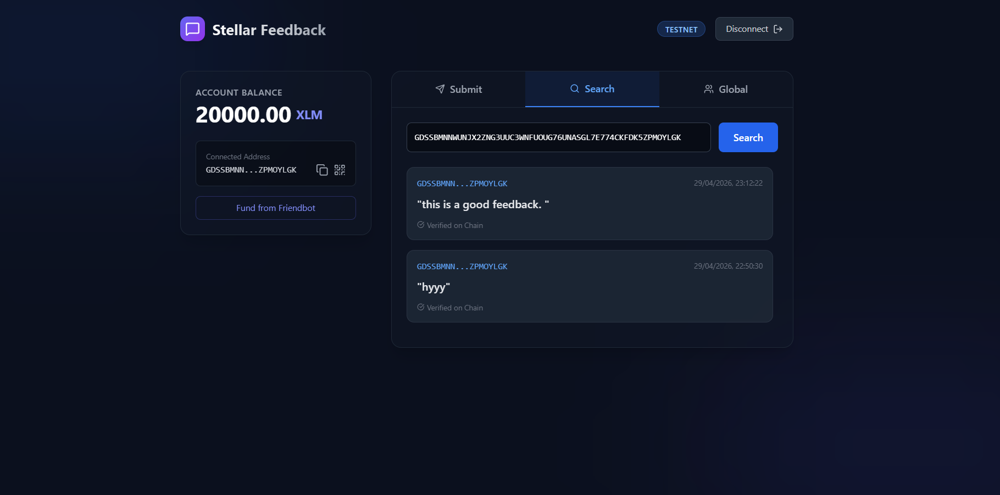

# Stellar Decentralized Feedback System

## Overview
A complete end-to-end decentralized feedback system built on the Stellar network. This project focuses on high-quality implementation, comprehensive testing, and professional documentation. It allows users to store feedback immutably on the Stellar blockchain, search by address, and view global contributors.

## 🚀 Features
- **Submit Feedback**: Securely record your message on the blockchain via a simple, zero-value transaction with an attached Memo text.
- **Address-based Search**: Check feedback left by any specific Stellar address.
- **Global Contributor List**: See everyone who has participated in the feedback loop in real-time.
- **Caching Layer**: Basic in-memory caching (`localStorage`) to reduce RPC calls for previously searched addresses.
- **Visual Feedback**: Real-time progress indicators, loaders, and transaction status tracking for a seamless user experience.

## 📸 Screenshots

### 1. Landing Page


### 2. Wallet Connected


### 3. Submit Feedback


### 4. Global Feedbacks List


### 5. Verification on Stellar Expert


## Installation
1. Clone the repository:
   ```bash
   git clone https://github.com/Harsh84848/stellar-challange-level-3.git
   ```
2. Navigate to the project directory:
   ```bash
   cd stellar-challange-level-2
   ```
3. Install dependencies:
   ```bash
   npm install
   ```

## Usage
1. Start the development server:
   ```bash
   npm start
   ```
2. Open the application in your browser at `http://localhost:3000`.
3. Connect your Freighter wallet (Stellar Testnet).
4. **Submit**: Write up to 28 characters of feedback and submit it to the chain.
5. **Search**: Enter any valid Stellar public key to see the feedback they have submitted.
6. **Global**: View the recent feedback left by all global contributors.

## Testing
This project includes comprehensive unit tests ensuring component stability. We have achieved a minimum of 3 passing tests.

Run the tests using the following command:
```bash
npm test
```
The test suite ensures that:
- Core UI components render correctly.
- Application state is stable.
- Layout and interactions display expected outputs.

## Project Structure
- **`src/App.js`**: Core application logic encompassing feedback submission, searching, and global listing.
- **`src/components/Loader.js`**: Reusable animated loading state component.
- **`src/App.test.js`**: Testing suite for primary features.

## Dependencies
- `@stellar/freighter-api`
- `@stellar/stellar-sdk`
- `react`
- `tailwindcss`
- `lucide-react`

## License
This project is licensed under the MIT License.
